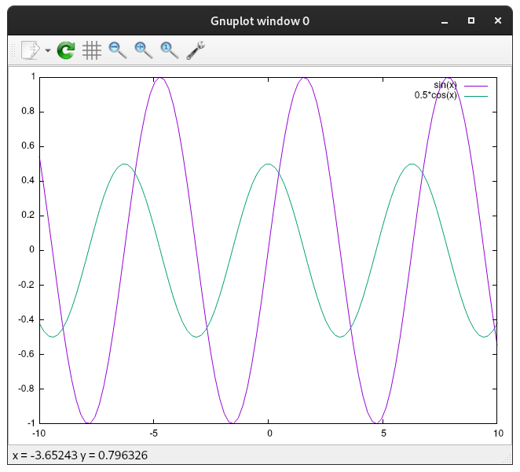
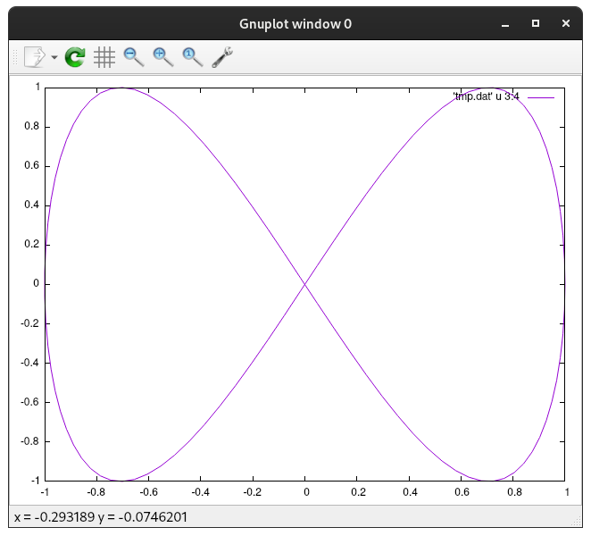

<h1 align="center">
    Lyrahgames' Gnuplot Pipeline Package
</h1>

<p align="center">
    C++ Header-Only Library Implementing a Really Simple Gnuplot Pipeline
</p>

<table align="center">
    <tr>
        <td></td>
        <td></td>
    </tr>
</table>

## Development Status

<p align="center">
    
    
    
    <a href="COPYING.md">
        
    </a>
</p>

<b>
<table align="center">
    <tr>
        <td>
            master
        </td>
        <td>
            <a href="https://github.com/lyrahgames/gnuplot">
                
            </a>
        </td>    
        <!-- <td>
            <a href="https://circleci.com/gh/lyrahgames/gnuplot/tree/master"></a>
        </td> -->
        <!-- <td>
            <a href="https://codecov.io/gh/lyrahgames/gnuplot">
              
            </a>
        </td> -->
        <td>
            <a href="https://ci.cppget.org/?builds=lyrahgames-gnuplot&pv=&tc=*&cf=&mn=&tg=&rs=*">
                
            </a>
        </td>
    </tr>
    <!-- <tr>
        <td>
            develop
        </td>
        <td>
            <a href="https://github.com/lyrahgames/gnuplot/tree/develop">
                
            </a>
        </td>    
        <td>
            <a href="https://circleci.com/gh/lyrahgames/gnuplot/tree/develop"></a>
        </td>
        <td>
            <a href="https://codecov.io/gh/lyrahgames/gnuplot">
              
            </a>
        </td>
    </tr> -->
    <tr>
        <td>
        </td>
    </tr>
    <tr>
        <td>
            Current
        </td>
        <td>
            <a href="https://github.com/lyrahgames/gnuplot">
                
            </a>
        </td>
        <!-- <td>
            
        </td>
        <td>
            
        </td> -->
        <td>
            
        </td>
        <td>
            
        </td>
        <!-- <td>
            <a href="https://queue.cppget.org/gnuplot">
                
            </a>
        </td> -->
    </tr>
</table>
</b>

## Requirements
<b>
<table>
    <tr>
        <td>Language Standard:</td>
        <td>C++20</td>
    </tr>
    <tr>
        <td>Compiler:</td>
        <td>
            GCC | Clang | MinGW | MSVC
        </td>
    </tr>
    <tr>
        <td>Build System:</td>
        <td>
            <a href="https://build2.org/">build2</a>
        </td>
    </tr>
    <tr>
        <td>Operating System:</td>
        <td>
            Linux | Windows | MacOS
        </td>
    </tr>
    <tr>
        <td>Dependencies:</td>
        <td>
            <a href="http://www.gnuplot.info/">
                gnuplot
            </a>
        </td>
    </tr>
</table>
</b>

## Usage with build2
Add this repository to the `repositories.manifest` file of your build2 package.

    :
    role: prerequisite
    location: https://github.com/lyrahgames/gnuplot.git

Add the following entry to the `manifest` file with a possible version dependency.

    depends: lyrahgames-gnuplot

Add these entries to your `buildfile`.

    import libs = lyrahgames-gnuplot%lib{lyrahgames-gnuplot}
    exe{your-executable}: {hxx cxx}{**} $libs


## Installation
The standard installation process will only install the header-only library with some additional description, library, and package files.

    bpkg -d build2-packages cc \
      config.install.root=/usr/local \
      config.install.sudo=sudo

Get the latest package release and build it.

    bpkg build https://github.com/lyrahgames/gnuplot.git

Install the built package.

    bpkg install lyrahgames-gnuplot

For uninstalling, do the following.

    bpkg uninstall lyrahgames-gnuplot

If your package uses an explicit `depends: lyrahgames-gnuplot` make sure to initialize this dependency as a system dependency when creating a new configuration.

    bdep init -C @build cc config.cxx=g++ "config.cxx.coptions=-O3" -- "?sys:lyrahgames-gnuplot/*"

## Alternative Usage
To use other build systems or manual compilation, you only have to add the `lyrahgames/gnuplot_pipe.hpp` file to your project and include it in the compilation process.

## Example
All given examples are provided in the `tests` folder and can be compiled and executed by cloning the repository and running build2 in the root folder.

### Basic
```c++
#include <lyrahgames/gnuplot/pipe.hpp>
using namespace lyrahgames;
int main() {
  gnuplot::pipe plot{};
  plot << "plot sin(x)\n"
       << "replot 0.5*cos(x)\n";
}
```

### Advanced Usage with File IO
```c++
#include <cmath>
#include <fstream>
#include <numbers>
//
#include <lyrahgames/gnuplot/pipe.hpp>

using namespace std;
using namespace numbers;
using namespace lyrahgames;

int main() {
  fstream file{"tmp.dat", ios::out};
  const int n = 100;
  for (size_t i = 0; i < n; ++i) {
    const auto phi = 2 * pi * i / (n - 1);
    const auto x = cos(phi);
    const auto y = sin(2 * phi);
    file << i << '\t' << phi << '\t' << x << '\t' << y << '\n';
  }
  file << flush;

  gnuplot::pipe plot{};
  plot << "plot 'tmp.dat' u 3:4 w l\n";
}
```

### Advanced Usage with Animations
```c++
#include <chrono>
#include <cmath>
#include <thread>
//
#include <lyrahgames/gnuplot/pipe.hpp>

using namespace std;
using namespace chrono_literals;
using namespace lyrahgames;

int main() {
  float a = 1;
  gnuplot::pipe plot{};
  for (size_t i = 0; i < 100; ++i) {
    plot << "plot sin(" << sin(a) << "*x)\n";
    a += 0.1;
    this_thread::sleep_for(50ms);
  }
}
```

## API
### Gnuplot Pipeline Constructor
```c++
lyrahgames::gnuplot::pipe::pipe();
```
Opens a Linux pipe to a new gnuplot process.
### Gnuplot Pipeline Destructor
```c++
virtual lyrahgames::gnuplot::pipe::~pipe();
```
Automatically closes and destroys the opened Linux pipe by using RAII principle.
### Gnuplot Pipeline Stream Operator
```c++
namespace lyrahgames::gnuplot {
template <typename T>
pipe& operator<<(pipe& plot, const T& t);
} // namespace lyrahgames::gnuplot
```
Given variable reference `t` of type `T` will be transformed into a string by using the standard stream operator `operator<<` and then send to the gnuplot process for further processing.

